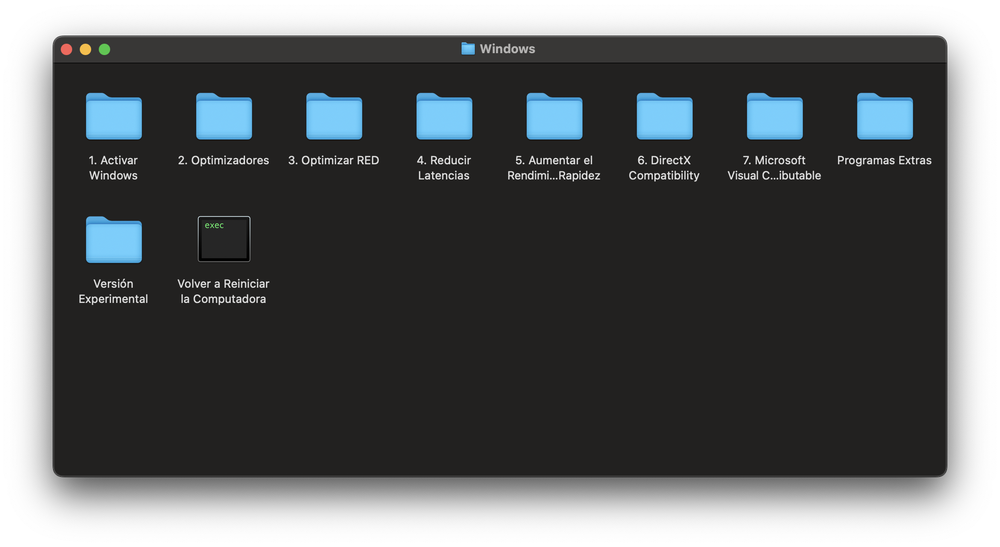

# 
Hello, I'm Daniel and this is my compilation to optimize the Windows operating system (later there will be one for macOS)

[comment]: <> (Optimizer File v1.0.0 [Feb/12/2024] )
- First, you need to download the [**Optimizer File**](./DaniOS-Optimizer.zip)

- Then, you need to unzip the _`.zip`_ file

- Finally, select the folder and _`open`_ it.

